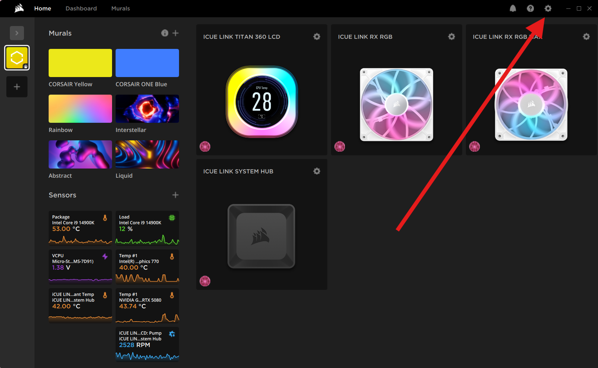
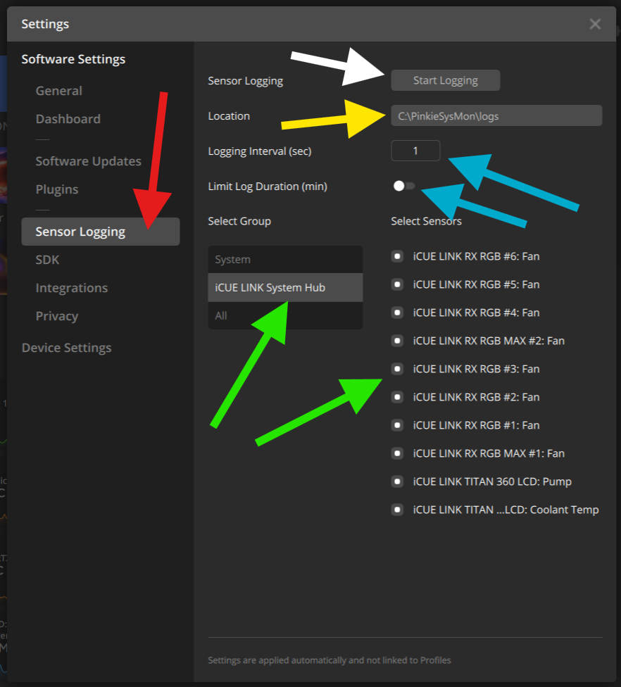
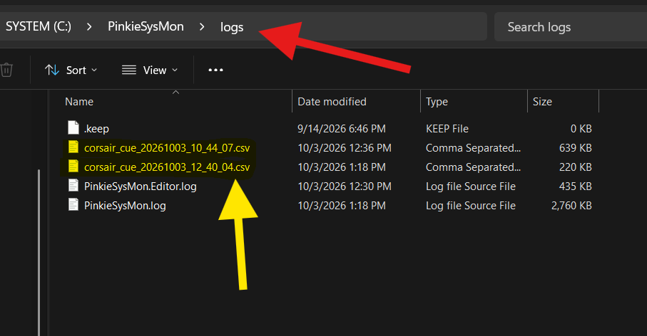
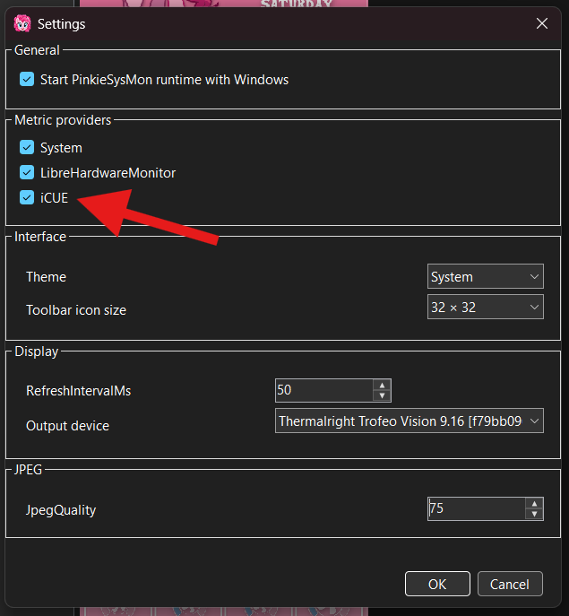
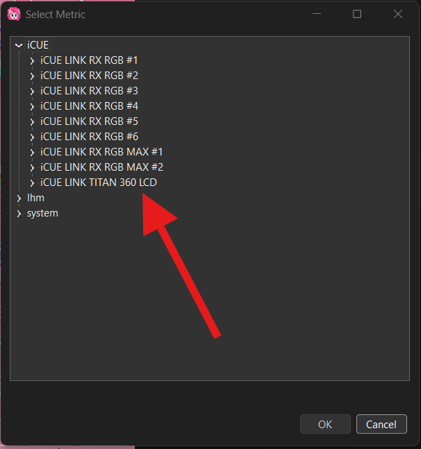

# iCUE Sensor Logging

Pinkie's System Monitor uses the Sensor Logging feature built into Corsair iCUE to collect metrics provided by iCUE. Sensor Logging continuously writes selected sensor readings to CSV files. To use these metrics, iCUE must be configured to write its sensor logs to the Pinkie's System Monitor log directory.

---
## User Setup

### Step 1

Open the iCUE GUI from the system tray and enter its settings.

!!! info
    Corsair iCUE must remain running for these metrics to be available. Pinkie's System Monitor does not access iCUE-managed hardware directly; it only reads the data written by iCUE Sensor Logging.

### Step 2

In iCUE settings, open the Sensor Logging section:

- Under Select Group, choose `iCUE LINK System Hub` or another device group whose metrics should be available in Pinkie's System Monitor.
- Select every sensor whose metrics should be available in Pinkie's System Monitor.
- Set Logging Interval to `1 second`.
- Disable Limit Log Duration so that logging does not stop automatically after a specified period.
- Pinkie's System Monitor expects iCUE logs in its `.\logs` directory. Set the Sensor Logging Location to that directory.
- Start Sensor Logging.

After Sensor Logging has started, the iCUE GUI window can be closed. Logging continues in the background as long as iCUE remains running and Sensor Logging is not stopped by the user.

!!! warning
    Some iCUE versions or configurations are known to remove individual sensors from Sensor Logging unexpectedly. If a previously available metric suddenly disappears from Pinkie's System Monitor, first check the selected sensor list and the Sensor Logging state in iCUE. Pinkie's System Monitor cannot reliably prevent this behavior because it occurs inside iCUE.

### Step 3

Let the system run for a couple of minutes, then verify that Sensor Logging CSV files are being created and updated in the Pinkie's System Monitor `.\logs` directory.

!!! info
    Pinkie's System Monitor manages iCUE Sensor Logging files automatically. It selects the newest valid log and removes old iCUE CSV files according to its retention rules. Other files in the `logs` directory, including Pinkie's System Monitor's own log files, are not affected.

### Step 4

Enable the iCUE metric provider in Pinkie's System Monitor settings.

If Runtime is already running, apply the changed settings through `Output → Start / Reload`.

!!! info
    When the provider is disabled, Pinkie's System Monitor does not poll the iCUE provider or process its metrics, avoiding unnecessary system load.

### Done

If data is being received correctly, the corresponding metrics appear under the iCUE group in the Pinkie's System Monitor metric selector.

!!! info
    The available metric set is generated automatically from the sensors present in the current Sensor Logging data.

    If a metric disappears from the logs or fresh data stops arriving, Pinkie's System Monitor marks that metric as unavailable. The resulting presentation depends on the widget type. For example, a `Text / Value` widget displays its configured `Fallback` value while the metric is unavailable.

---
## Technical Information

### Provider Boundary and Identity

The iCUE provider is a read-only adapter for Corsair iCUE Sensor Logging CSV files. It does not communicate with Corsair devices directly and does not attempt to control hardware already owned by iCUE.

The current implementation is provided by `IcueSensorLogTelemetrySource`.

- Provider ID: `icue`
- Source name: `icue-sensor-log`
- Dynamic metric namespace: `icue.*`
- Default polling interval: `1000 ms`
- Default provider state: disabled

The provider is registered in both Runtime and Dashboard Editor. Its enabled state is stored in `AppConfig.MetricProviders` under the `icue` key. Runtime scheduling only includes iCUE metrics when the provider is enabled and the active dashboard actually requires those metrics.

The provider's dynamic metric IDs remain resolvable through `CanProvide()` even when no current iCUE catalog is available. This allows dashboards and configuration containing existing `icue.*` metric IDs to remain structurally valid while the external data source is temporarily unavailable.

### Log Directory and File Discovery

The provider reads Sensor Logging files only from:

  ``<application root>`\logs`

Only files matching the following pattern are considered:

  `corsair_cue_*.csv`

Discovery is limited to the top level of the `logs` directory; subdirectories are not searched.

During normal capture, log discovery is performed at most once every `5 seconds`. Candidate files are ordered by filesystem last-write time, newest first. If two files have the same last-write time, their filenames are used as a descending case-insensitive tie-breaker.

A file is considered a valid candidate only if its first CSV row:

- can be read successfully;
- contains at least two fields;
- has `Timestamp` as the first field, compared case-insensitively.

Files are read as UTF-8 with BOM detection. They are opened with read access while allowing the writer to continue writing, renaming, or deleting them. This is required because iCUE owns the active CSV file while Pinkie's System Monitor is consuming it.

The newest valid file becomes the active log. Switching to a different active log rebuilds the complete iCUE metric catalog, clears the previous cached values, initializes the new file from its latest complete sample when possible, replaces the provider's dynamic metric descriptors, and runs iCUE log cleanup.

If discovery temporarily finds no valid log but an active log was already known, the existing active path is retained. Its previously read values are not treated as indefinitely valid; normal freshness rules eventually make the metrics unavailable.

### CSV Parsing and Incremental Reading

The provider contains its own lightweight CSV line parser. It supports:

- comma-separated fields;
- quoted fields;
- commas inside quoted fields;
- escaped double quotes represented by two consecutive double quotes.

Parsing is line-oriented. The current reader does not support a quoted CSV field that contains an embedded newline.

The provider consumes the active file incrementally rather than reparsing the complete CSV on every poll.

When a log first becomes active, the provider examines at most the final `1 MiB` of the file and finds the latest complete line. That line is used as the initial sample when available, and the reader position is placed immediately after the last complete newline.

During subsequent captures, only newly appended bytes are read.

If more than `1 MiB` of unread data accumulates between reads, the provider deliberately skips the backlog and resumes from the newest complete sample. This protects Runtime from spending excessive time replaying obsolete telemetry. A throttled warning is written to the application log when this happens.

A final incomplete line is kept in memory until the next read. The pending fragment is limited to `64 KiB`. If an unterminated fragment exceeds that size, it is discarded and a throttled warning is logged.

If the active file becomes shorter than the saved read position, the provider treats this as a truncation or replacement event and forces log rediscovery and catalog refresh. If the active file disappears during a read, the provider also forces rediscovery.

### Metric Catalog and Persistent Metric Identity

The iCUE catalog is built from the CSV header.

The first `Timestamp` column is not published as a telemetry metric. Every remaining non-empty header column becomes a candidate metric.

The metric ID is constructed as:

  `icue.` + ``<trimmed CSV column name>``

For example, a column named:

  `iCUE LINK System Hub: Coolant Temp`

produces the metric ID:

  `icue.iCUE LINK System Hub: Coolant Temp`

Metric lookup is case-insensitive, but the source header text is preserved for presentation.

The complete CSV column name is therefore part of the persisted Pinkie's System Monitor metric identity. If iCUE changes a column name, the resulting metric ID also changes. The provider does not silently alias renamed iCUE columns to old metric IDs.

For display in the metric selector, the provider splits a column name at its last `: ` separator:

- text before the separator becomes the device name;
- text after the separator becomes the sensor name.

If that separator is not present in a usable position, the complete column name is used as both the device name and the sensor name.

The metric selector presents discovered iCUE metrics using the hierarchy:

  `iCUE → Device → Sensor Group → Sensor`

The Editor caches last-known iCUE catalog metadata for the current process. If a dashboard already references an iCUE metric that is no longer present in the discovered catalog, the selector preserves that metric as an unavailable entry instead of silently replacing or deleting it.

### Duplicate and Ambiguous Metrics

Metric IDs are unique within the iCUE provider namespace.

If the current CSV header produces the same metric ID more than once, compared case-insensitively, that metric is classified as ambiguous.

Ambiguous metrics are not published into the active provider catalog. A throttled warning is logged, and capture returns `null` for requests matching that ambiguous ID.

This behavior is intentional: Pinkie's System Monitor must not guess which duplicate iCUE column represents the requested metric.

### Value Kind and Unit Inference

iCUE Sensor Logging does not provide Pinkie's System Monitor with a separate strongly typed metric schema. The provider therefore infers the Pinkie's System Monitor value contract when the catalog is built.

Inference uses the sensor name together with the latest available sample value. The current rules are applied in this order:

- sample suffix `RPM`, or sensor name exactly `Fan` or `Pump` → Number / RPM;
- sample suffix `°C`, or sensor name containing `Temp` or `Temperature` → Number / Celsius;
- sample suffix `%` → Percent;
- sample suffix `MHz` → Number / MHz;
- sample suffix `GHz` → Number / GHz;
- sample suffix `kHz` → Number / kHz;
- sample suffix `Hz` → Number / Hz;
- sample suffix `W` → Number / Watts;
- sample suffix `V` → Number / Volts;
- sample suffix `A` → Number / Amperes;
- anything else → Number with no declared base unit.

For percent metrics, `MetricValueKind.Percent` carries the percentage semantics; the base unit remains `None`.

The inferred descriptor is registered dynamically through `MetricContract.ReplaceProviderDescriptors()` under the `icue.*` namespace. This allows the standard unit and formatting system to use the same metric descriptor path as other providers.

The inferred contract belongs to the current discovered catalog. It is not a separately persisted schema owned by iCUE.

### Sensor Group Inference

The Editor derives an additional presentation group for each discovered sensor:

- sensor name exactly `Fan` → `Fans`;
- sensor name exactly `Pump` → `Pumps`;
- temperature unit, or sensor name containing `Temp` or `Temperature` → `Temperatures`;
- all other sensors → `Sensors`.

These groups are presentation metadata for the metric selector. They are not part of the persistent metric ID.

### Numeric Value Parsing

Published iCUE values are numeric.

For each selected CSV field, the provider extracts the numeric prefix from the beginning of the field. The accepted numeric prefix may contain:

- decimal digits;
- leading `+` or `-`;
- decimal point;
- decimal comma;
- exponent marker `e` or `E`.

Any unit suffix following the numeric prefix is ignored after the number has been extracted.

If the extracted number contains a comma but no period, the comma is converted to a period before invariant-culture parsing. Empty values and values without a parseable numeric prefix become `null`.

The CSV `Timestamp` value itself is not used as the telemetry value timestamp.

### Freshness and Unavailable Semantics

The provider tracks freshness using the active CSV file's filesystem last-write time.

Whenever at least one catalog metric is applied from a complete sample, that file last-write time becomes the provider's most recent sample-write time.

A sample is considered fresh for `15 seconds`. During capture, a requested iCUE metric returns `null` when any of the following is true:

- the metric ID is ambiguous;
- the metric is not present in the current catalog;
- no fresh sample has been observed within the last `15 seconds`;
- the current field has no successfully parsed value.

The provider therefore does not keep publishing an old value indefinitely when iCUE stops updating its log.

At the telemetry-engine boundary, provider failures are isolated from other providers. If an iCUE capture throws, the affected requested metrics are published as `null` while unrelated telemetry providers continue operating.

When telemetry reconfiguration deactivates an iCUE metric, the previously active metric is explicitly published as `null` before the new schedule becomes active.

### Demand-Driven Polling

The provider participates in Pinkie's System Monitor's demand-driven telemetry scheduler.

Runtime does not poll the entire iCUE catalog continuously. It requests only iCUE metrics referenced by the active dashboard and permitted by the current telemetry policy.

The source default interval is `1000 ms`. If a requested dynamic iCUE metric has no explicit entry in `telemetry.json`, the scheduler falls back to that source default.

Disabling the iCUE provider removes its metrics from the active schedule. The provider remains registered as a source so that existing `icue.*` metric identities can still be resolved structurally.

### Editor Integration

The Dashboard Editor owns a separate `IcueSensorLogTelemetrySource` instance for preview and metric discovery.

When the iCUE provider is enabled:

- Editor preview captures only the iCUE metrics required by the current dashboard;
- iCUE preview telemetry is snapshot-based and is not polled directly from the preview render timer;
- opening the metric selector performs a fresh iCUE catalog discovery;
- discovered descriptors are registered through `MetricContract`;
- discovered metrics are displayed under the `iCUE` provider hierarchy;
- last-known metadata is retained in memory so an already selected metric can still be shown as unavailable if it disappears.

If iCUE discovery fails while opening the selector, the selector remains usable. Existing iCUE metric selections are left unchanged and are reported as unavailable rather than being removed.

Changing the provider setting in the Editor immediately updates the Editor-side configuration and preview snapshot. A running Runtime process must reload its configuration before the provider change affects Runtime scheduling.

### Log Retention and Cleanup

Pinkie's System Monitor performs cleanup only on files matching:

  `corsair_cue_*.csv`

Cleanup does not target arbitrary files in the `logs` directory.

The current retention contract is:

- always retain the active log;
- retain one additional newest matching iCUE log file when available, for a minimum retained set of two files including the active log;
- never delete a matching file whose last-write time is less than `10 minutes` old;
- older matching files outside the retained set may be deleted.

Cleanup runs when a log is activated or its catalog is refreshed. Failure to delete an old file is non-fatal and is recorded as a throttled warning.

### Error Handling and Logging

The provider treats filesystem and optional-provider failures as recoverable conditions wherever possible.

Warnings related to recurring iCUE file problems are throttled to one occurrence per key every `30 seconds`. Throttled conditions include discovery failures, file enumeration failures, header and tail read failures, duplicate metrics, catch-up skips, oversized pending fragments, and cleanup failures.

Provider state is protected by an internal synchronization lock so catalog changes, incremental reads, and capture operations cannot mutate the same state concurrently.

A successful catalog refresh writes an informational message containing the active filename, published metric count, and ambiguous metric count.

### Maintenance Contracts

The following contracts are specific to this provider and should be preserved unless an intentional compatibility change is being made:

- iCUE integration remains read-only; Pinkie's System Monitor does not compete with iCUE for device control.
- The provider owns the `icue.*` metric namespace.
- Persisted iCUE metric identity is derived from the trimmed Sensor Logging CSV column name.
- A missing, stale, ambiguous, or non-parseable metric becomes unavailable as `null` rather than retaining an old value indefinitely.
- Duplicate column-derived metric IDs are rejected rather than resolved heuristically.
- Active iCUE logs must remain readable while iCUE is writing them.
- Discovery and tail reading must remain bounded; the provider must not replay arbitrarily large log backlogs.
- Cleanup must remain restricted to matching iCUE Sensor Logging files and must preserve the defined retention and minimum-age safeguards.
- Dynamic descriptors must remain confined to the `icue.*` provider namespace.
- Changes to CSV column-name identity, unit inference, stale timing, file selection, or cleanup semantics are compatibility-sensitive and should receive deterministic regression coverage when modified.
