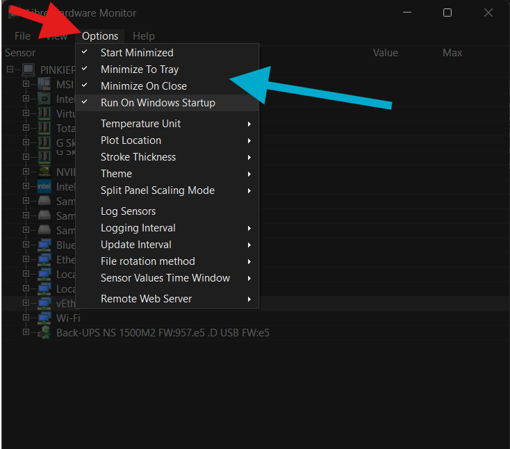
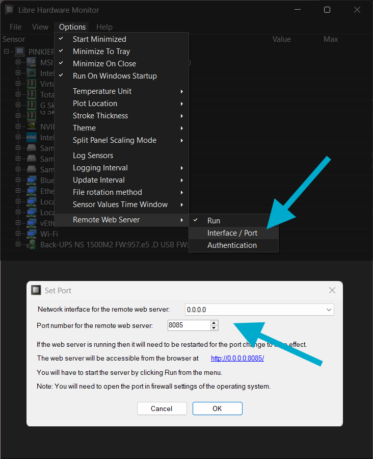
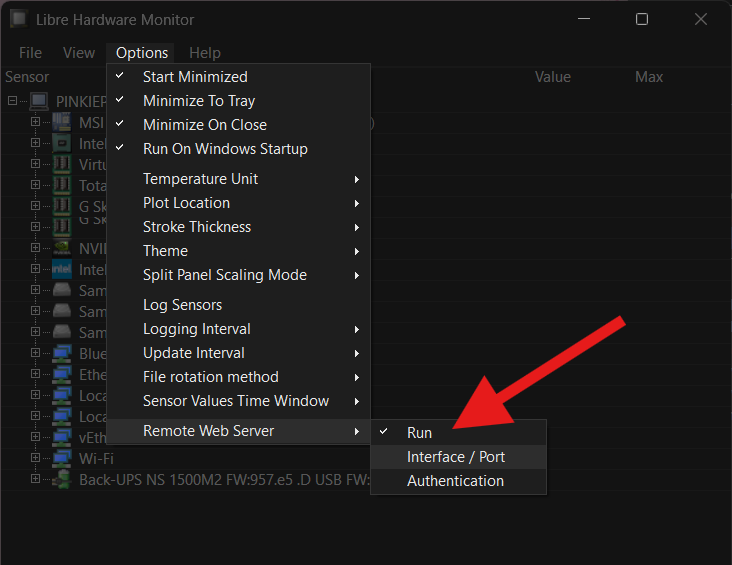
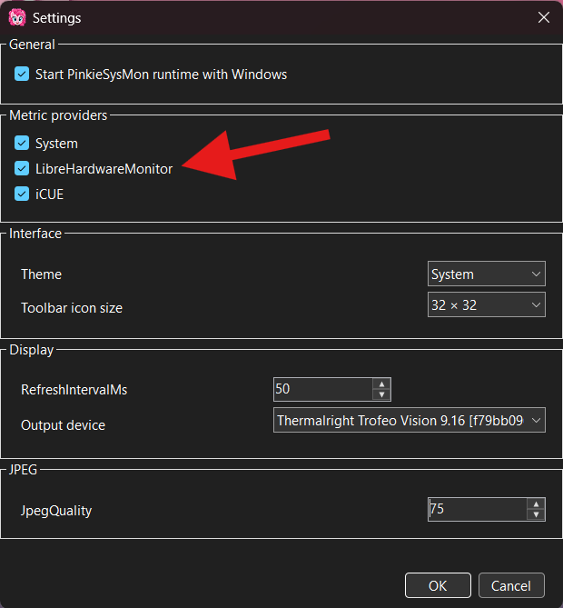
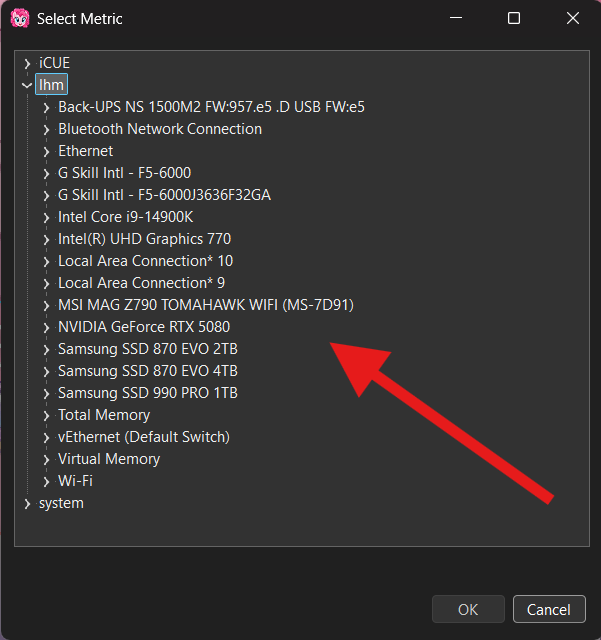

# Libre Hardware Monitor

Pinkie's System Monitor uses Libre Hardware Monitor to obtain an extended set of hardware metrics, including temperatures, voltages, clock frequencies, loads, power readings, fan speeds, and other sensors exposed by LHM.

Pinkie's System Monitor does not access hardware controllers directly and does not start its own Libre Hardware Monitor instance. Data is obtained through the local HTTP API of an already running LHM application.

## User Setup

---
### Step 1

Install and start [Libre Hardware Monitor](https://github.com/LibreHardwareMonitor/LibreHardwareMonitor).

For convenient background operation, it is recommended to enable the following options:

- Start Minimized
- Minimize To Tray
- Minimize On Close
- **Run On Windows Startup** (recommended)

!!! info
    Libre Hardware Monitor must remain running whenever Pinkie's System Monitor uses its metrics.

    Pinkie's System Monitor can only access sensors that are available in Libre Hardware Monitor itself. If a sensor is not present in LHM, it will not appear in Pinkie's System Monitor either.

---
### Step 2

Check `Options → Remote Web Server → Interface / Port`:

- The network interface must allow connections from the same computer. `127.0.0.1` is sufficient and preferred when available; `0.0.0.0` also works but is not required.
- Port must be set to `8085`.

!!! warning
    The current Pinkie's System Monitor implementation automatically searches for Libre Hardware Monitor only on the local computer and uses the standard port `8085`.

    Changing the Remote Web Server port or enabling HTTP authentication will make the provider unavailable.

---
### Step 3

Under `Options → Remote Web Server`, enable `Run`.

Remote Web Server authentication must remain disabled.

---
### Step 4

In Pinkie's System Monitor settings, enable the LibreHardwareMonitor metric provider.

If Runtime is already running, apply the changed settings through `Output → Start / Reload`.

!!! info
    When the provider is disabled, Pinkie's System Monitor does not poll Libre Hardware Monitor and does not include its metrics in the active telemetry schedule.

---
### Done

If Libre Hardware Monitor is running, its Remote Web Server is active, and the provider is enabled, the available sensors will appear in the Pinkie's System Monitor metric selector.

!!! info
    The metric list is generated automatically from the current hardware and sensor set exposed by Libre Hardware Monitor.

    If LHM becomes unavailable, a hardware device disappears, or a particular sensor can no longer be read, the corresponding Pinkie's System Monitor metric becomes unavailable. The resulting presentation depends on the widget type that uses the metric.

## Technical Information

---
### Provider Boundary and Identity

The Libre Hardware Monitor provider is a read-only adapter for the local HTTP API exposed by the external Libre Hardware Monitor application.

Pinkie's System Monitor:

- does not use the LibreHardwareMonitor library for direct hardware access;
- does not create its own hardware-monitoring instance;
- does not compete with Libre Hardware Monitor for privileged device access;
- does not control hardware through the LHM API;
- consumes only sensor data already exposed by the running Libre Hardware Monitor instance.

The external Libre Hardware Monitor application remains the owner of hardware-sensor access.

The current provider implementation is:

  `LibreHardwareMonitorRawTelemetrySource`

Core identifiers and parameters:

- Provider ID: `lhm`
- Source name: `libre-hardware-monitor-raw`
- Dynamic metric namespace: `lhm.*`
- Default polling interval: `1000 ms`
- Default provider state: disabled

The provider is registered in both Runtime and Dashboard Editor.

Its enabled state is stored in `AppConfig.MetricProviders` under the `lhm` key.

`CanProvide()` considers any non-empty metric in the `lhm.*` namespace structurally resolvable even when the corresponding sensor is not present in the current catalog. This allows a dashboard containing a previously saved LHM metric to remain structurally valid while the external provider is temporarily unavailable.

### HTTP Transport and Endpoint Discovery

Communication with Libre Hardware Monitor is handled by:

  `LibreHardwareMonitorHttpClient`

Only local HTTP transport is supported.

The standard endpoint is:

  `http://127.0.0.1:8085/`

The standard port is:

  `8085`

If the loopback endpoint is unavailable, Pinkie's System Monitor also probes local IP addresses assigned to the current computer on the same port. IPv4 addresses are checked before IPv6 addresses.

Remote computers are not valid LHM telemetry sources. The selected endpoint must resolve to the current computer.

The current transport accepts only:

- the `http` scheme;
- the HTTP server root;
- a local address of the current computer;
- port `8085` during automatic discovery.

An endpoint containing credentials, a query string, a fragment, or a path below the server root is not valid.

The current implementation does not support Libre Hardware Monitor HTTP authentication.

The provider uses two LHM API endpoints:

- `GET /data.json` — discovers the hardware tree, sensors, and associated metadata;
- `POST /Sensor?action=Get&id=`<SensorId>`` — obtains the current value of a regular sensor.

The default HTTP timeout is `1 second`.

After a transport failure, retry attempts are subject to a `5 second` backoff interval. This prevents a continuous stream of blocking requests while Libre Hardware Monitor is stopped or its web server is unavailable.

When an endpoint is discovered, recovered after a failure, or replaced by another valid local endpoint, the transport increments its internal state generation. The telemetry source uses this generation change to force a catalog refresh after transport state changes.

### Catalog Discovery and Refresh

The available metric catalog is built from:

  `/data.json`

While traversing the tree, the provider records:

- `SensorId`;
- sensor type;
- user-visible sensor name;
- nearest hardware node;
- full hardware path;
- sensor-group name exposed by LHM.

The normal catalog lifetime is:

  `1 minute`

If the catalog is still valid and the transport state has not changed, the provider does not fetch the complete `data.json` tree again.

The catalog is refreshed before its normal expiration when:

- transport state changes;
- a requested `lhm.*` metric is missing from the current catalog;
- an existing sensor read fails and the catalog is invalidated;
- an explicit `RefreshCatalog()` is requested.

When a provider-native metric is missing, a forced catalog refresh occurs at most once per capture batch.

After successful discovery, the provider replaces its dynamic descriptors through:

  `MetricContract.ReplaceProviderDescriptors()`

within the `lhm` provider namespace.

### Persistent Metric Identity

Persistent identity is based on the `SensorId` provided by Libre Hardware Monitor.

A valid `SensorId` must:

- begin with `/`;
- contain a non-empty path;
- contain no empty `//` path segments.

A regular metric ID is constructed as:

  `lhm.` + `SensorId without the leading "/" and with "/" replaced by "."`

For example:

  `/gpu-nvidia/0/temperature/0`

becomes:

  `lhm.gpu-nvidia.0.temperature.0`

Metric ID comparison is case-insensitive.

Hardware names, user-visible sensor names, the node's position in `data.json`, and the internal numeric LHM node ID are not part of the normal persistent metric ID.

If Libre Hardware Monitor changes the `SensorId` itself, Pinkie's System Monitor treats the resulting ID as a different metric. No automatic alias is created between different SensorId values.

### Hardware Hierarchy and Metric Selector Presentation

While building the catalog, Pinkie's System Monitor preserves the full hardware path from the tree root to the hardware node that owns the sensor.

The Metric selector uses a hierarchy of the form:

  `LHM → Hardware → ... → Sensor Group → Sensor`

The hardware hierarchy comes directly from the Libre Hardware Monitor tree.

Whenever possible, Sensor Group also uses the LHM TypeNode itself, for example:

- `Temperatures`
- `Loads`
- `Powers`
- other groups exposed by LHM.

If stored metadata is incomplete, Editor can reconstruct the group name from `SensorType`.

Hardware path, hardware names, sensor group, and display name are presentation metadata and do not change persistent metric identity.

### Duplicate SensorId and Ambiguous Sensors

Libre Hardware Monitor can, in some cases, return multiple distinct sensors with the same `SensorId`.

Pinkie's System Monitor does not choose one of them arbitrarily.

If all conflicting entries have unique, non-empty sensor names, the provider creates stable synthetic metric IDs for them.

The format is:

  ``<base metric ID>`~`<sensor-name-slug>``

For example:

  `lhm.gpu-nvidia.0.load.3~gpu-bus`

and:

  `lhm.gpu-nvidia.0.load.3~gpu-memory`

The slug is derived from the normalized sensor name.

If different sensor names produce the same slug, a short deterministic hash of the original name is appended.

For these synthetic metrics, the value is read directly from the current `data.json` tree snapshot because the regular `Sensor?action=Get` endpoint cannot distinguish multiple sensors that share the same SensorId.

If the conflicting entries cannot be distinguished safely using stable semantic metadata — for example, if their names are identical or empty — the base metric ID is classified as ambiguous and is not published.

The value of such a metric is returned as `null`.

Tree order and the internal numeric LHM node ID are deliberately not used to resolve these conflicts because they are not considered stable persistent identity.

### Value Kinds and Units

The metric value kind and base unit are derived from the `SensorType` exposed by Libre Hardware Monitor.

The current mapping is:

| LHM SensorType | Pinkie's System Monitor contract |
| --- | --- |
| `Voltage` | Number / Volts |
| `Current` | Number / Amperes |
| `Power` | Number / Watts |
| `Clock` | Number / Megahertz |
| `Temperature` | Number / Celsius |
| `Load` | Percent |
| `Frequency` | Number / Hertz |
| `Fan` | Number / RevolutionsPerMinute |
| `Flow` | Number / LitersPerHour |
| `Control` | Percent |
| `Level` | Percent |
| `Factor` | Number / no base unit |
| `Data` | DataSize / Gibibytes |
| `SmallData` | DataSize / Mebibytes |
| `Throughput` | Number / BytesPerSecond |
| `TimeSpan` | Duration / Seconds |
| `Timing` | Number / Nanoseconds |
| `Energy` | Number / MilliWattHours |
| `Noise` | Number / DecibelsA |
| `Conductivity` | Number / MicroSiemensPerCentimeter |
| `Humidity` | Percent |
| unknown type | Number / no base unit |

For `Percent` semantics, the base unit in `MetricDescriptor` remains `None`; percentage semantics are carried by `MetricValueKind.Percent`.

`Throughput` has one special case:

- a sensor named `Connection Speed` is treated as `BitsPerSecond`;
- all other `Throughput` sensors are treated as `BytesPerSecond`.

This distinction is compatibility-sensitive because it determines correct conversions between `bit/s`, `Byte/s`, `Mbit/s`, `MiB/s`, and other data-rate units.

### Reading Current Values

For a regular metric, the current value is read using:

  `POST /Sensor?action=Get&id=`<SensorId>``

The LHM response contains:

- current value;
- min;
- max;
- format.

The current Pinkie's System Monitor provider uses only the current `value` for telemetry.

`min`, `max`, and `format` are not part of the published metric value.

For synthetic metrics created to resolve duplicate SensorId entries, values are extracted from the current `data.json` snapshot.

For a single capture batch, the complete tree snapshot is loaded for these metrics at most once.

### Numeric Value Parsing

Values obtained from `data.json` may be stored in:

- `RawValue`;
- `Value`.

`RawValue` has priority.

Both JSON numbers and string representations of numbers are supported.

The parser attempts:

- invariant culture;
- current system culture.

Some Libre Hardware Monitor versions can return a formatted value even in `RawValue`. The transport therefore contains a compatibility fallback that extracts the leading numeric token from the string.

Supported numeric forms include:

- optional `+` or `-` sign;
- decimal separator;
- exponent notation.

`NaN`, infinity, and other non-finite values are not published and become unavailable / `null`.

### Availability and Failure Recovery

Unlike the iCUE Sensor Logging provider, the LHM provider does not use a retained last value as an independent freshness cache.

Every active metric poll obtains the current value through the live Libre Hardware Monitor HTTP API.

A requested metric returns `null` when:

- Libre Hardware Monitor or its HTTP server is unavailable;
- the metric is still missing after a catalog refresh;
- the metric ID is classified as ambiguous;
- the request for the corresponding SensorId fails;
- the response does not contain a valid finite numeric value;
- a synthetic metric can no longer be found in the current tree snapshot.

If a regular sensor read fails, the current catalog is invalidated so that a subsequent capture can rediscover the current hardware state.

A transport failure moves the HTTP client into an unavailable state. A new connection attempt is allowed after `5 seconds`.

After successful recovery, the transport state generation changes, forcing the source to refresh the catalog.

An old value is not kept published indefinitely after LHM or a sensor disappears.

### Demand-Driven Polling

The shared scheduling eligibility and metric-deactivation rules belong to [Application Architecture → Runtime data path](../development/architecture.md#runtime-data-path).

For **`lhm`**, Runtime requests only the current dashboard's sensor metrics from the enabled provider, not the entire dynamically discovered catalog.

The provider default polling interval is:

  `1000 ms`

If a dynamic LHM metric has no dedicated entry in `telemetry.json`, the scheduler uses this default interval.

If an individual policy exists in `telemetry.json`, its `IntervalMs` and `Enabled` settings apply normally.

When a metric is deactivated, the shared [scheduler contract](../development/architecture.md#runtime-data-path) publishes `null` rather than retaining stale data. The independent HTTP/sensor recovery contract remains under [Availability and Failure Recovery](#availability-and-failure-recovery).

### Editor Integration

Dashboard Editor uses a separate:

  `LibreHardwareMonitorRawTelemetrySource`

instance for preview telemetry.

The separate LHM source follows the shared [Editor snapshot/render-timer boundary](../development/architecture.md#editor-versus-runtime-state). With `lhm` enabled, preview requests only LHM metrics required by the current dashboard.

When the Metric selector is opened, Editor performs a fresh discovery using `LibreHardwareMonitorHttpClient` and `data.json`.

The resulting catalog is used to:

- build the Metric selector hierarchy;
- create dynamic `MetricDescriptor` instances;
- register descriptors in `MetricContract`;
- determine availability of the currently selected metric.

Editor keeps last-known LHM metadata in memory for the lifetime of the current process.

If a previously selected LHM metric temporarily disappears or LHM discovery fails:

- the existing Metric property value is not changed;
- the metric is not automatically replaced with another metric;
- the selector remains usable;
- the existing metric is shown as unavailable.

An LHM provider failure in Editor must not make the Metric selector unusable.

### Failure Isolation

Libre Hardware Monitor is an optional telemetry provider.

An LHM provider failure must not stop the telemetry engine or disrupt other providers.

If an LHM source capture throws an exception, the telemetry engine:

- catches the exception at the provider boundary;
- publishes `null` for all LHM metrics in the current capture batch;
- continues processing the remaining telemetry sources.

Optional-provider failures therefore remain isolated within that provider's telemetry boundary.

### Logging and Diagnostics

When an HTTP endpoint is discovered successfully for the first time, its address is written to the application log.

The log also records:

- endpoint recovery after unavailability;
- a change in the selected local endpoint;
- successful metric-catalog refresh;
- transport failures;
- protocol and JSON parsing failures;
- duplicate SensorId conditions;
- successful duplicate SensorId disambiguation;
- ambiguous metrics.

After a successful catalog refresh, the log records:

- total number of published metrics;
- number of tree-backed duplicate metrics;
- number of ambiguous metric IDs.

Repeated transport and protocol warnings are limited by a throttle interval of:

  `30 seconds`

This preserves useful diagnostics without continuously flooding the application log while Libre Hardware Monitor remains unavailable.

### Existing Regression Coverage

The current regression suite contains dedicated deterministic guards for provider-specific contracts:

- `LHM duplicate sensor ID disambiguation`
- `LHM throughput unit semantics`

The first protects duplicate SensorId resolution rules, synthetic metric IDs, the prohibition against choosing an arbitrary winner, and compatibility parsing of formatted `RawValue` data.

The second protects the distinction between:

- regular `Throughput` → bytes per second;
- `Connection Speed` → bits per second;

and the associated data-rate conversions.

### Maintenance Contracts

The following contracts are specific to the Libre Hardware Monitor provider and should be preserved unless compatibility is intentionally changed:

- Libre Hardware Monitor remains the external owner of privileged hardware access.
- Pinkie's System Monitor must not embed or start a competing LibreHardwareMonitor instance for direct hardware polling.
- Integration remains read-only from the Pinkie's System Monitor side.
- The provider uses only a local HTTP endpoint on the current computer.
- The current automatic-discovery contract uses port `8085`.
- The persistent metric namespace belongs to this provider and uses the `lhm.*` prefix.
- Regular persistent metric identity is derived from the LHM `SensorId`, not from display name, tree order, or numeric node ID.
- Hardware hierarchy and sensor groups are presentation metadata and must not silently become persistent identity.
- Duplicate SensorId entries are resolved only through stable semantic metadata. An arbitrary tree node must never be selected as the winner.
- An ambiguous, missing, or unreadable metric must become unavailable / `null` instead of retaining an old value indefinitely.
- An unknown SensorType is not a fatal error and is published as a numeric metric with no declared base unit.
- Unit mapping, especially `Throughput` and the special `Connection Speed` case, is a compatibility-sensitive contract.
- Dynamic LHM descriptors must remain confined to the `lhm.*` provider namespace.
- An LHM provider failure must remain isolated from all other telemetry providers.
- Changes to SensorId → MetricId rules, duplicate disambiguation, endpoint discovery, unit semantics, or unavailable behavior should receive deterministic regression coverage whenever the contract can be tested reliably.
