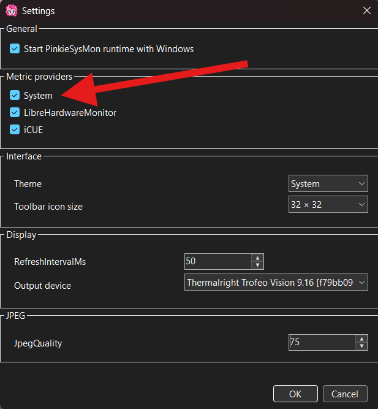
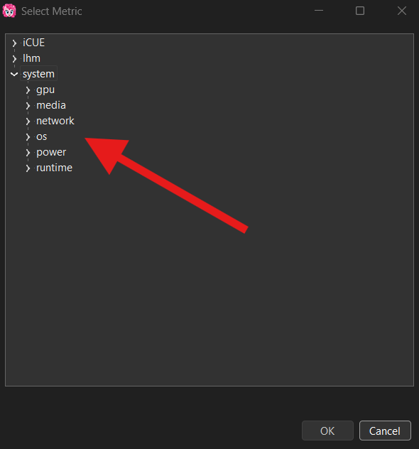

# System

The System provider gives Pinkie's System Monitor a set of metrics obtained directly from Windows and from Runtime itself: operating system information, local date/time and uptime, network connectivity, power and battery status, integrated GPU load, audio and media state, and internal Pinkie's System Monitor runtime metrics.

The provider does not require any third-party software to be installed or configured.

---
## User Setup

### Step 1

In Pinkie's System Monitor settings, make sure the `System` provider is enabled under Metric providers.

!!! info
    The `System` provider is enabled by default and normally requires no additional setup.

    It does not require any external applications, services, log directories, network ports, or other parameters.

If Runtime is already running and the provider state has been changed, apply the new settings through `Output → Start / Reload`.

### Done

Once the provider is enabled, the available system metrics appear under the `system` branch in the Pinkie's System Monitor metric selector.

!!! info
    A metric appearing in the selector means that Pinkie's System Monitor knows its system contract. The actual value of some metrics depends on the current hardware, Windows capabilities, and availability of the corresponding system source.

    For example, the integrated GPU metric will be unavailable if the system has no suitable integrated graphics adapter, and UPS metrics will be unavailable if Windows does not report a connected UPS.

---
## Technical Information

### Provider Boundary and Identity

System is a built-in Pinkie's System Monitor telemetry provider.

Unlike Libre Hardware Monitor and iCUE, it is not an adapter to a single external application. The provider combines several Windows-oriented telemetry sources and a separate channel for internal Runtime metrics.

Core identifiers and parameters:

- Provider ID: `system`
- Display name: `System`
- Metric namespace: `system.*`
- Default provider state: enabled

The provider state is stored in:

  `AppConfig.MetricProviders["system"]`

If the value is absent during configuration normalization, System uses the default state `enabled`.

System metrics have statically defined `MetricDescriptor` contracts and are registered directly in `MetricContract`. They do not require dynamic catalog discovery comparable to LHM or iCUE.

A descriptor being present does not guarantee that a current value is available. A metric may be structurally known to the application while returning `null` when the corresponding Windows source or hardware is unavailable.

### Provider Composition

The System provider combines the following sources:

| Source | Implementation | Default interval | Purpose |
| --- | --- | --- | --- |
| Windows system | `WindowsSystemTelemetrySource` | `1000 ms` | OS identity, local date/time, uptime, integrated GPU load |
| Windows network | `WindowsNetworkTelemetrySource` | `5000 ms` | Internet connectivity state |
| Windows power | `WindowsPowerTelemetrySource` | `5000 ms` | UPS and battery telemetry |
| Windows media | `WindowsMediaTelemetrySource` | `1000 ms` | Default audio endpoints and media playback |
| Runtime metrics | `FramePump` / output-session path | `1000 ms` publication interval | Pinkie's System Monitor runtime and output statistics |

All four `IMetricSource` implementations are registered as separate telemetry sources but share:

  `ProviderId = "system"`

`system.runtime.*` metrics are an exception: they do not pass through the regular `IMetricSource` scheduling path and are published directly by the active output session.

Provider enablement controls publication and scheduling of these metrics as a single user-facing category.

The internal System source objects are created when Runtime or Editor starts regardless of the checkbox state. Provider enablement is therefore primarily a telemetry scheduling and publication boundary rather than a mechanism for conditionally loading the source classes.

### Static Metric Catalog

Unlike the dynamic `lhm.*` and `icue.*` namespaces, the set of System metric IDs is defined by the application source code.

All descriptors are assembled into `MetricContract` from:

- `SystemMetricContract`
- `NetworkMetricContract`
- `PowerMetricContract`
- `MediaMetricContract`
- `RuntimeMetricContract`

Primary metric families:

- `system.os.*`
- `system.gpu.*`
- `system.network.*`
- `system.power.*`
- `system.media.*`
- `system.runtime.*`

Metric IDs are part of the persistent dashboard contract and must not be renamed without an intentional compatibility change.

### Operating System and General System Metrics

`WindowsSystemTelemetrySource` publishes:

| Metric ID | Contract |
| --- | --- |
| `system.os.edition` | Text |
| `system.os.release` | Text |
| `system.os.build` | Text |
| `system.os.installed` | DateTime |
| `system.os.datetime` | DateTime |
| `system.os.uptime` | Duration / Seconds |
| `system.gpu.integrated.load` | Percent |

Part of the OS identity is loaded once when the source is created and is then used as a static snapshot for the lifetime of the current process.

OS identity is obtained from:

- WMI class `Win32_OperatingSystem`;
- Windows registry key `HKLM\SOFTWARE\Microsoft\Windows NT\CurrentVersion`.

`system.os.edition` is obtained from the WMI `Caption` value.

`system.os.installed` is created from the WMI `InstallDate` value.

`system.os.build` is built from WMI `BuildNumber` and the registry `UBR` value when both are available.

`system.os.release` uses the registry `DisplayVersion` value, falling back to `ReleaseId` when necessary.

Failure to obtain an individual OS identity value is not fatal. The corresponding metric remains `null`.

`system.os.datetime` is produced directly from local:

  `DateTime.Now`

`system.os.uptime` is calculated from:

  `Environment.TickCount64`

and published in seconds.

### Integrated GPU

The metric:

  `system.gpu.integrated.load`

is provided by the internal helper:

  `WindowsIntegratedGpuTelemetry`

It intentionally does not depend on Libre Hardware Monitor.

Windows DXCore is used to identify integrated graphics adapters.

The provider:

- obtains active D3D11-capable hardware adapters;
- selects adapters that DXCore marks as hardware and integrated;
- retains their LUID identifiers;
- matches those identifiers to Windows GPU Engine performance counters.

Current load is read from WMI:

  `Win32_PerfFormattedData_GPUPerformanceCounters_GPUEngine`

GPU Engine exposes separate counters for processes and engines. Pinkie's System Monitor aggregates process instances belonging to the same physical engine and then uses the most heavily loaded engine as the representative load for the adapter.

The resulting value is clamped to:

  `0 .. 100 %`

If no integrated hardware graphics adapter is found, the metric returns `null`.

After a discovery failure or LUID change, adapter discovery is retried. The minimum interval between discovery attempts is:

  `30 seconds`

A DXCore discovery failure or Windows performance-counter failure must not affect the remaining System metrics.

### Network Connectivity

The network source is implemented by:

  `WindowsNetworkTelemetrySource`

It publishes one metric:

| Metric ID | Contract |
| --- | --- |
| `system.network.internet.connected` | Boolean |

Default polling interval:

  `5000 ms`

Connectivity is determined through the Windows Network List Manager COM API and its:

  `IsConnectedToInternet`

property.

This represents the connectivity state known to Windows. Pinkie's System Monitor does not perform its own ping, DNS query, or external HTTP request to verify Internet access.

Possible values:

- `true` — Windows reports Internet connectivity;
- `false` — Windows reports no Internet connectivity;
- `null` — the state could not be determined.

A Network List Manager failure is isolated inside the source. The metric becomes unavailable while the remaining telemetry sources continue to operate.

After recovery, the Windows network telemetry source automatically resumes normal polling.

### Power Telemetry

The power source is implemented by:

  `WindowsPowerTelemetrySource`

Data is read through WMI:

  `Win32_Battery`

Default polling interval:

  `5000 ms`

Two logical groups are published:

- UPS
- Battery

Metric IDs:

| Metric ID | Contract |
| --- | --- |
| `system.power.ups.charge` | Percent |
| `system.power.ups.runtime.remaining` | Duration / Seconds |
| `system.power.ups.state` | Text |
| `system.power.battery.charge` | Percent |
| `system.power.battery.runtime.remaining` | Duration / Seconds |
| `system.power.battery.state` | Text |

When processing `Win32_Battery`, Pinkie's System Monitor classifies a device as a UPS if its combined WMI identity contains:

- `UPS`
- `uninterruptible`

The comparison is case-insensitive.

From the detected devices, the first UPS and the first non-UPS battery are used.

`EstimatedChargeRemaining` is normalized to:

  `0 .. 100 %`

`EstimatedRunTime` is converted from minutes to seconds.

An undefined WMI runtime value is not published and becomes `null`.

Supported normalized power states:

- `online`
- `on-battery`
- `charging`
- `low`
- `critical`
- `fully-charged`
- `normal`
- `unknown`
- `unavailable`

Current normalization of WMI `BatteryStatus`:

| BatteryStatus | State |
| --- | --- |
| `1` | `on-battery` |
| `2` | `online` |
| `3` | `fully-charged` |
| `4` | `low` |
| `5` | `critical` |
| `6`, `7` | `charging` |
| `8` | `low` |
| `9` | `critical` |
| `10` | `unavailable` |
| `11` | `normal` |
| any other or missing code | `unknown` |

The provider translates `Win32_Battery.BatteryStatus` through `PowerMetricContract.FromWmiBatteryStatus`. Codes `8` and `9` are combined charging/low and charging/critical conditions; the mapping preserves the more urgent low or critical state instead of converting them to `charging`. The state is derived from the WMI status code, **not from a widget's charge-percentage threshold**.

If the WMI power query fails, charge and runtime become `null`, while state is published as `unavailable`.

A power telemetry failure must not affect the remaining System sources.

### Media Telemetry

The media source is implemented by:

  `WindowsMediaTelemetrySource`

It combines three logical groups:

- default audio output;
- default audio input;
- current media playback session.

Default polling interval:

  `1000 ms`

#### Audio Output

Output metrics:

| Metric ID | Contract |
| --- | --- |
| `system.media.output.id` | Text |
| `system.media.output.name` | Text |
| `system.media.output.type` | Text |
| `system.media.output.volume` | Percent |
| `system.media.output.muted` | Boolean |
| `system.media.output.available` | Boolean |

The default Windows multimedia render endpoint is used.

Windows Core Audio is accessed through the managed NAudio API.

When the default device changes, an endpoint is added or removed, or its state changes, the source marks the endpoint cache for refresh. The actual refresh occurs during the next normal telemetry capture.

#### Audio Input

Input metrics:

| Metric ID | Contract |
| --- | --- |
| `system.media.input.id` | Text |
| `system.media.input.name` | Text |
| `system.media.input.type` | Text |
| `system.media.input.volume` | Percent |
| `system.media.input.muted` | Boolean |
| `system.media.input.active` | Boolean |
| `system.media.input.available` | Boolean |

The default Windows multimedia capture endpoint is used.

`system.media.input.active` is determined by the presence of an active Windows audio session on the current default input endpoint.

No active sessions means:

  `false`

An inability to determine the state means:

  `null`

Therefore, inactive and unavailable are distinct states.

#### Audio Endpoint Type

`WindowsMediaTelemetrySource.EndpointType` reads Windows audio endpoint form-factor metadata and publishes the corresponding canonical type. This is a **System provider** classification contract, not a Media System widget operation.

| Windows form factor | Published endpoint type |
| --- | --- |
| Remote Network | `remote-network` |
| Speakers | `speakers` |
| Line Level | `line-level` |
| Headphones | `headphones` |
| Microphone | `microphone` |
| Headset | `headphones` |
| Handset | `handset` |
| Digital Passthrough | `digital-passthrough` |
| S/PDIF | `spdif` |
| Display Audio | `display-audio` |
| Missing, unreadable, or unrecognized form factor | `unknown` |

Windows Headset is intentionally normalized to Headphones; there is no separate `headset` published type. `MediaMetricContract.NormalizeEndpointType` trims and lowercases known type tokens and maps other values to `unknown`. When no default endpoint exists, the producer publishes `available = false` separately; an available but unrecognized endpoint is **Unknown**, not Unavailable.

**Application-level endpoint-type overrides:** overrides are stored in `AppConfig.Media.EndpointTypeOverrides`, keyed by the exact Windows **endpoint ID** rather than its friendly name. The Editor's [Media System override controls](../widgets/media-system.md#step-7-override-an-incorrectly-classified-endpoint) offer `Auto` (removes the saved entry) or one of the ten canonical types.

`WindowsMediaTelemetrySource` normalizes configured override values and, for the current default input or output endpoint with a matching ID, publishes the override instead of the detected form factor. The override changes the **reported classification**, not endpoint identity, Windows default-device selection, audio capability, or volume. The mapping belongs to app configuration, **not dashboard JSON**, and is not a separate System-provider enablement setting.

#### Media Playback

Playback metrics:

| Metric ID | Contract |
| --- | --- |
| `system.media.playback.status` | Text |
| `system.media.playback.title` | Text |
| `system.media.playback.artist` | Text |
| `system.media.playback.album` | Text |
| `system.media.playback.source` | Text |
| `system.media.playback.progress` | Percent |
| `system.media.playback.available` | Boolean |

Media playback integration uses Windows:

  `GlobalSystemMediaTransportControlsSessionManager`

Pinkie's System Monitor tracks the **current** media session and responds to session/list changes and playback-state, media-metadata, and timeline events. On a session switch it detaches handlers from the old session, attaches them to the new session, and refreshes the playback snapshot.

Supported normalized playback states:

- `closed`
- `opened`
- `changing`
- `stopped`
- `playing`
- `paused`
- `unavailable`

`MediaMetricContract.NormalizePlaybackState` recognizes these incoming status tokens. The live `WindowsMediaTelemetrySource` normally resets a Windows session reporting `Closed` to the **Unavailable** snapshot before publication. When no session exists or playback info cannot be read, it likewise resets to `status = unavailable` and `available = false`, instead of retaining a stale prior state. `Opened` and `Changing` remain possible status tokens; the [Media Player widget](../widgets/media-player.md#playback-state-normalization) selects its Unavailable profile for them.

A current media session may provide playback status and source application identity while withholding optional metadata or a usable timeline. The provider does not fabricate missing values.

If title, artist, or album metadata is missing, the value used is:

  `[unknown]`

Playback progress is calculated from the Windows timeline.

While the state is `playing`, Pinkie's System Monitor extrapolates the current position from `LastUpdatedTime` using the playback rate so that progress can change smoothly between system timeline updates.

If a Windows SMTC session is available but does not provide a timeline, the normal result for progress is `null`.

#### AIMP Timeline Fallback

A narrow implementation-specific fallback exists for AIMP.

If:

- the active Windows media session belongs to AIMP;
- SMTC provides state and metadata;
- SMTC does not provide usable TimelineProperties;

Pinkie's System Monitor can obtain position and duration through the AIMP Remote Access window-message API.

The window class used is:

  `AIMP2_RemoteInfo`

The fallback is used only to calculate the canonical:

  `system.media.playback.progress`

It does not create a separate AIMP provider and does not change public metric identity.

The window-message request timeout is:

  `100 ms`

Failure of the AIMP fallback simply leaves playback progress unavailable.

### Runtime Metrics

`system.runtime.*` metrics belong to the System provider but use a separate publication path.

They are not `IMetricSource` metrics and are not scheduled by the regular `TelemetryEngine`.

Metric IDs:

| Metric ID | Contract |
| --- | --- |
| `system.runtime.version` | Text |
| `system.runtime.frame` | Number |
| `system.runtime.render.duration` | Duration / Milliseconds |
| `system.runtime.encode.duration` | Duration / Milliseconds |
| `system.runtime.usb.duration` | Duration / Milliseconds |
| `system.runtime.frame.duration` | Duration / Milliseconds |
| `system.runtime.fps` | Number / FramesPerSecond |
| `system.runtime.jpeg.size` | DataSize / Bytes |
| `system.runtime.usb` | Text |

These metrics are published directly by the `FramePump` of the active output session.

Publication interval for the current runtime performance metrics:

  `1000 ms`

`system.runtime.version` and the current USB state are published when the runtime metric publisher is assigned.

Runtime metrics use a global legacy namespace and are not per-output metrics in the current architecture.

If multiple output sessions are active at the same time, exactly one session is assigned as the publisher for `system.runtime.*`. The remaining sessions do not publish this namespace.

This prevents multiple output targets from writing competing values to the same global metric IDs.

When there is no active output session, all `system.runtime.*` metrics are cleared to `null`.

When the System provider is disabled, runtime metrics also stop being published and are cleared.

The `usb` names in these metric IDs are **existing runtime contracts**, not claims that arbitrary USB-connected displays are compatible. Refer to [Supported Devices](../supported-devices.md) for the actual hardware compatibility list.

Known USB state values currently produced by `FramePump` include:

- `WAITING`
- `CONNECTED`
- `SUSPENDED`
- `ERROR`

### Demand-Driven Polling

Regular System `IMetricSource` metrics participate in the shared demand-driven telemetry scheduler.

Runtime polls only metrics that:

- are actually required by the current dashboard;
- belong to the enabled `system` provider;
- are permitted by the corresponding policy in `telemetry.json`.

If a metric has no individual policy, the `DefaultIntervalMs` of its source is used.

Current defaults:

- Windows system — `1000 ms`
- Windows network — `5000 ms`
- Windows power — `5000 ms`
- Windows media — `1000 ms`

The minimum telemetry interval allowed by the shared telemetry configuration is:

  `100 ms`

`system.runtime.*` metrics are an exception to this mechanism. They are published directly by the output session and are not controlled by individual `telemetry.json` entries.

### Availability and Failure Isolation

The System provider must not retain an old value as valid when the current source can no longer provide it.

For regular scheduled System metrics, absence of a value is published as:

  `null`

If an exception occurs inside one `IMetricSource`, the telemetry engine:

- catches the exception at the source boundary;
- publishes `null` for the requested metrics from that source;
- continues capturing the remaining telemetry sources.

For example:

- a power WMI failure must not break network or media telemetry;
- a DXCore or GPU performance-counter failure must not make OS metrics unavailable;
- a Windows media API failure must not stop the overall telemetry loop.

During reconfiguration, metrics that cease to be active because the provider was disabled, the dashboard changed, or telemetry policy changed are published as `null` before scheduler state is changed.

This prevents stale values from remaining after metric deactivation.

### Editor Integration

Dashboard Editor creates its own instances of:

- `WindowsSystemTelemetrySource`
- `WindowsNetworkTelemetrySource`
- `WindowsPowerTelemetrySource`
- `WindowsMediaTelemetrySource`

for preview telemetry.

Editor preview uses the snapshot model. External or potentially blocking telemetry calls are not executed directly from the render timer.

When the System provider is enabled, preview requests only the System metrics actually required by the current dashboard.

Opening the Metric selector does not perform a separate System discovery operation.

Editor takes the statically registered `MetricDescriptor` entries in the:

  `system.*`

namespace and presents them in the selector as structurally available.

A System metric may therefore be present in the selector even when its current runtime value is unavailable.

This is an intentional distinction between:

- existence of the metric contract;
- availability of the current value.

When the System provider is disabled, its metrics are not added to the normal Metric selector list.

### Provider Enablement

The System provider is enabled by default.

The provider checkbox controls the shared provider ID:

  `system`

rather than the individual internal sources.

Provider settings cannot independently disable only:

- network;
- power;
- media;
- integrated GPU;
- OS telemetry.

Finer control over regular scheduled metrics is provided by dashboard demand and individual telemetry policy.

When the System provider is disabled:

- its regular metrics are removed from the TelemetryEngine schedule;
- deactivated scheduled metrics are published as `null`;
- Editor stops System preview capture;
- System metrics are no longer offered in the normal Metric selector;
- `system.runtime.*` publication is disabled and current runtime values are cleared.

### Logging and Diagnostics

System sources use the shared application log.

Primary diagnostic events include:

- Windows OS identity query failure;
- DXCore integrated GPU discovery failure and recovery;
- GPU performance-counter failure and recovery;
- Network List Manager failure and recovery;
- Windows power WMI failure and recovery;
- audio endpoint enumeration failures;
- default audio endpoint failures;
- input audio-session failures;
- Windows media-session initialization failures;
- playback metadata, state, and timeline failures.

Repeated Windows media errors are logged with a throttle interval of:

  `30 seconds`

The telemetry engine also applies provider/source failure isolation and throttled logging to exceptions that escape an individual source.

### Existing Regression Coverage

The current regression suite contains deterministic guards related to the System provider and its shared telemetry contracts, including:

- `Telemetry provider failure isolation`
- `Telemetry reconfiguration clears deactivated metrics`
- `Telemetry reconfiguration prepare/commit isolation`
- `Windows internet connectivity metric`

`Windows internet connectivity metric` specifically verifies:

- Boolean contract;
- `5000 ms` polling baseline;
- `true` when connected;
- `false` when disconnected;
- `null` when the system connectivity probe fails.

Additional regression tests protect related Power, Media System, Media Player, and Runtime/dashboard contracts, but they must not be treated as substitutes for runtime validation against actual Windows WMI, Core Audio, DXCore, or SMTC sources.

### Maintenance Contracts

The following contracts are specific to the System provider and should be preserved unless compatibility is intentionally changed:

- Provider ID remains `system`.
- The System provider is enabled by default.
- The provider does not require an external telemetry application for its primary Windows metrics.
- The persistent metric namespace remains `system.*`.
- System metric descriptors are a static application contract, not a dynamic hardware catalog.
- Absence of a current value must be represented as unavailable / `null`, not by retaining a stale value.
- Failure of one System source must not block the remaining sources or the telemetry engine.
- Network connectivity remains Windows NLM state rather than an arbitrary external connectivity probe.
- The integrated GPU metric remains Windows-native and must not silently acquire a dependency on Libre Hardware Monitor.
- The power source must not invent UPS or battery values that are absent from `Win32_Battery`.
- `false` and `null` have different semantics for Boolean metrics and must not be conflated.
- Media endpoint identity uses the stable Windows endpoint ID; friendly name is display metadata.
- Endpoint type override is presentation metadata and does not change endpoint identity.
- Public media playback metrics remain provider-neutral even when a source-specific fallback is used.
- AIMP Remote Access remains a narrow fallback for playback progress only when the SMTC timeline is unavailable and does not become a separate public metric namespace.
- `system.runtime.*` remains a global legacy namespace until a separate decision is made to move to per-output identity.
- Exactly one active output session must own publication of the global runtime metrics.
- Disabling the provider or deactivating a metric must not leave stale values in `MetricStore`.
- Changes to System metric IDs, value kinds, units, polling semantics, power-state mapping, endpoint-type mapping, or runtime publication semantics are compatibility-sensitive and should receive deterministic regression coverage whenever the corresponding contract can be tested reliably.
